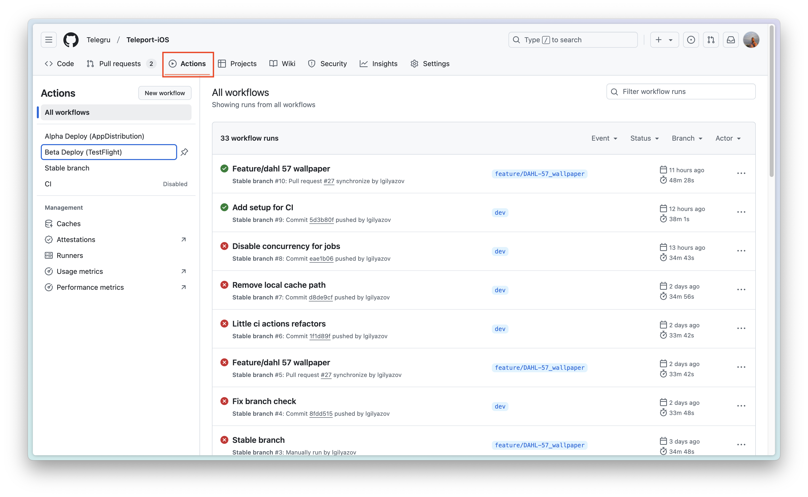
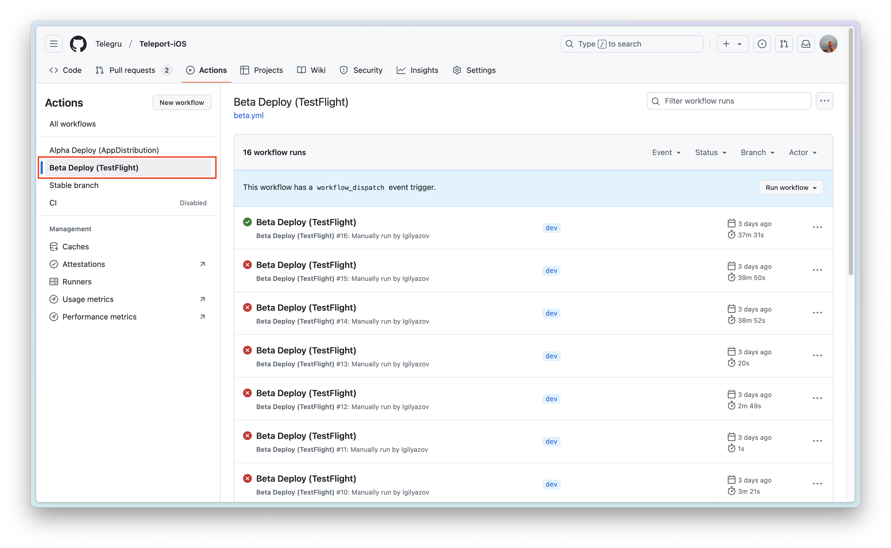

# CI и автоматизации

## Автоматизации

### Генерация проекта

Для удобства работы с сертификатами и релизными сборками, добавлена автоматизация для работы с этим.

Команда поддерживает 3 типа сборок:

- appstore (Она же релизная)
- adhoc (Для альфа сборок)
- developer (По умолчанию. Использовать для разработки. В этом варианте отключены appextensions)

Для генерация проекта необходимо вызывать следующую команду из директории ci:

```bash
fastlane generate_proj
# или для генерации для определенного типа сборки
fastlane generate_proj build_type:appstore
```

## CI

### Проверки на PR

Для стабильности дева и мастера перед влитием любых изменений добавлена джоба, которая собирает проект и проверяет, что сборка не сломана. Только после заверщения проверки можно будет влить все изменения. Если требуется влить, что-то очень срочно и уверены, что изменения ничего не сломают, то у админов есть права влить изменения игнорирую все проверки. Обращайтесь к ним.

### Сборка и загрузка в AppStore

Процесс сборки автоматизирован на CI. Это можно сделать с любой ветки. Для сборки проекта с ветки перейдите по [ссылке](https://github.com/Telegru/Teleport-iOS/actions/workflows/beta.yml) или во вкладку Actions в репозитории проекта.



Слева выбираете Beta Deploy (TestFlight)



Далее нажимаете кнопку Run workflow и указываете нужную ветку.

### Сборка и загрузка в AppDistribution

Сборка в AppDistribution выполняется аналогично пункту выше. За исключением 2 пункта. Где нужно выбрать Alpha Deploy (AppDistibution) или же перейти по прямой [ссылке](https://github.com/Telegru/Teleport-iOS/actions/workflows/alpha.yml)
